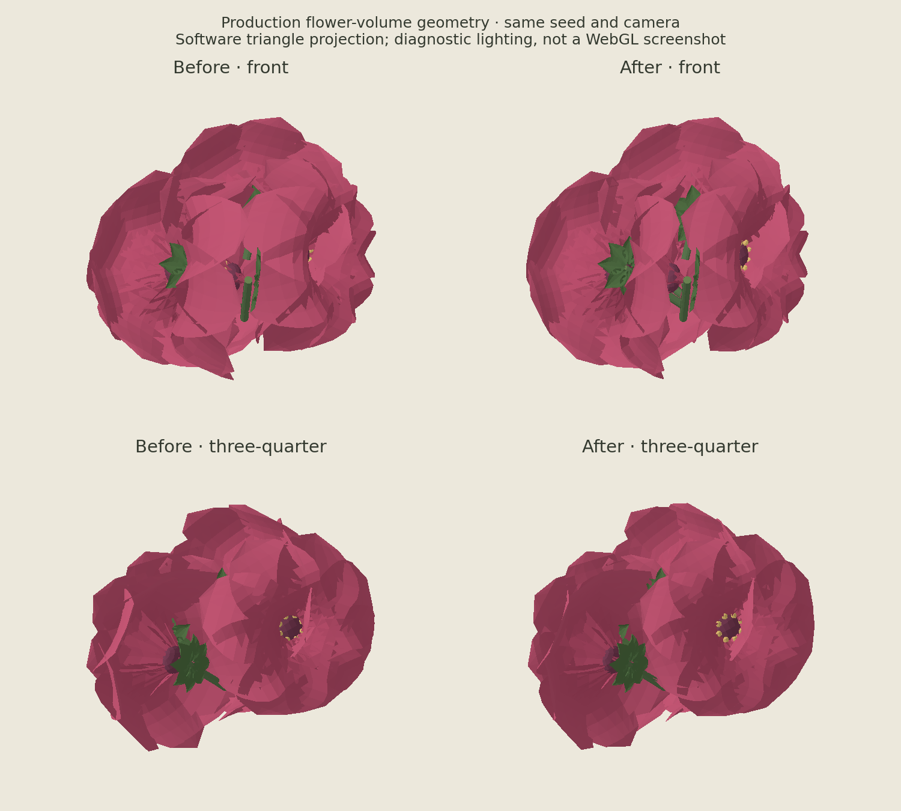

# Flower-volume geometry check

`flower-volume-software-before-after.png` is an offline geometry diagnostic,
not a browser capture or evidence of WebGL appearance or physical-phone feel.

The preview compares the existing tufted petals with the conservative final
profile using `flower-volume-v1`, `plant-1`, seed `8278`, base `(0, 0.55, 0)`.
Generator geometry, organ transforms, petal count, color, and camera poses are
the same in both columns. Only the tufted petal surface's local depth changes.

## Method

- Construct the graph through `createFlowerVolume` and its visual through the
  production `ThreeStudio.createPlantVisual` / `syncPlantVisual` path.
- For each bloom, export visible child meshes, including each instanced petal
  and anther with `matrixWorld * instanceMatrix`. Exclude acquisition proxies.
  Include supporting pedicel meshes. This gives 8,700 triangles per variant.
- The before geometry comes from `botanicalGeometry.ts` at
  `41475621703bd61a8f0863fe906ffdabcbc92229`. The
  after geometry retains 70% of the existing domed depth and blends 30% of a
  softer raised-rim profile. X/Y coordinates, topology, and instance transforms
  are unchanged. The production formula uses the equivalent combined weights.
- Project through the canonical Front and Three-quarter camera orientations,
  using perspective division. Use a shared crop and scale for each view pair.
- Draw depth-sorted triangles with Matplotlib `PolyCollection`. Apply the
  production base and vertex colors, approximate two-sided diffuse shading
  from a light at `(-3, 8, 7)`, ambient weight `0.42`, and linear-to-sRGB
  conversion. No shadow map, physically based renderer, antialiasing, or
  browser-specific rendering is reproduced.

## Interpretation and limits

A more aggressive opening of the cup made the five groups read as overlapping
discs. It was rejected. The final small blend retains the rounded head and
scalloped petals while slightly reducing the deepest folds. This supports a
conservative geometry refinement, not a claim about its final browser lighting
or motion. The software painter can also exaggerate triangular seams where
surfaces intersect.

Separately, production geometry checks found that the old small-leaf and
flowering-cup acquisition spheres did not contain their visible tips. Leaf
proxies are now centered on their blades; the cupped bloom proxy now covers
its petals. The focused automated test checks every visible vertex, including
actual per-instance transforms, for all registered leaf/bloom forms and seeds
`0`, `8278`, `9255`, `10232`, and `4294967295`. It failed with each old undersized
proxy and passed after correction. Those checks establish geometric coverage,
not first-try touch acquisition rates.

The coverage assertion uses the actual convex face planes of the raycast mesh,
not its ideal sphere radius. The cupped flower needs radius `0.60` to account for
the ten-sided proxy: `0.57` covered the ideal sphere but left a few petal tips
outside its flat faces. All sampled leaf and bloom surfaces pass the actual
faceted-envelope check, including the centered small-leaf proxies.
