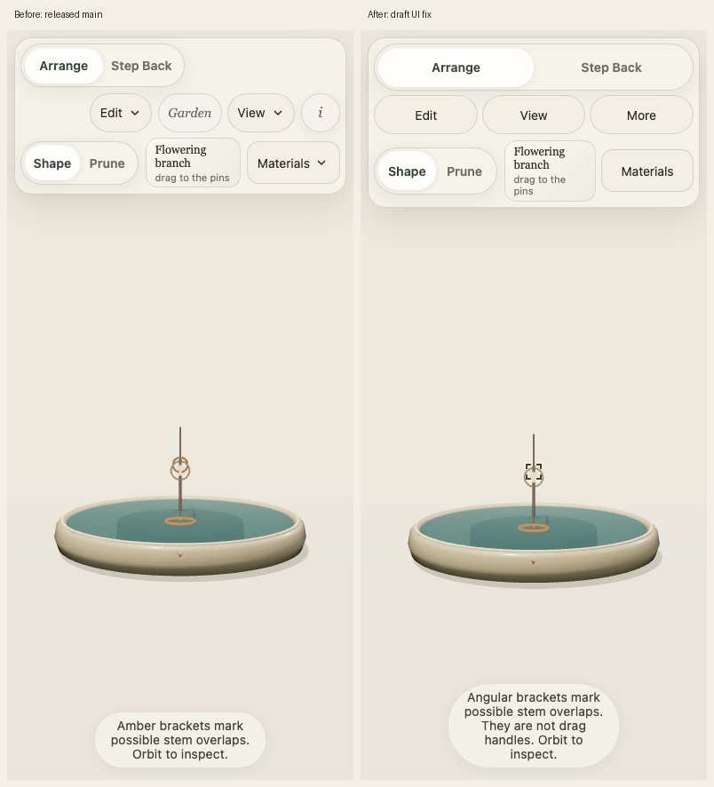
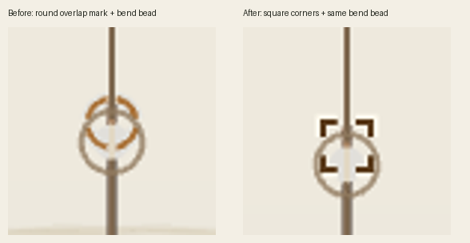
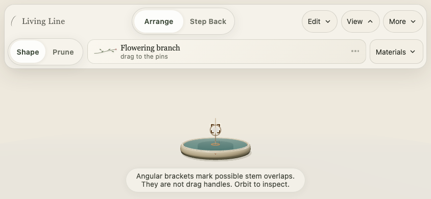

# Phone toolbar and contact indicator

On the owner's iPhone, the upper mode/actions wrapped into uneven rows and
the round overlap mark could be mistaken for a bend bead. This focused change
groups phone controls into two intentional rows: Arrange / Step Back, then
equal Edit / View / More disclosures. More contains Garden and Guide with
descriptive secondary text and a named accessible opener. Wider screens keep
one top row. Enlarged text can wrap the craft/material rail without clipping it.

Contact/overlap marks now use four straight square corners and an open centre.
The bend bead stays round. Dark `#593919` ink and pale `#fffbee` outlining have
10.02:1 authored sRGB contrast (8.10:1 ink against the stage's `#e8e3d7`). Full
opacity and disabled tone mapping keep these indicator colors independent of
scene exposure; antialiased edge pixels naturally vary. Existing overlay order,
CSS-pixel scaling, culling, draw cap and unpickability remain in place. Copy
states that brackets are indicators and describes the same approximate contact
scope. No core geometry, generator, protection solver or storage schema changes.
Inspection and protection remain separately optional, default-off View toggles.







The matched renders use the same canonical two-stem QA graph in fresh profiles,
normal chrome with `?test=1`, Front view, and native mouse selection. They are
diagnostic stems, not a new authored material or a judged arrangement. Cropped
detail is enlarged from the original screenshots. The normal lens responds to
rail height, so screen framing can differ while the botanical state is identical.

## Automated evidence

Base: `07ea79b299eb106a080472fadc4688cb86c059ae` (released PR61).
Mac checks use existing Node 24.16.0 with command-local PATH; no system settings
or installed software were changed. Playwright Chromium runs headless in newly
created temporary profiles/contexts on separate localhost origins. No connection
to the player's browser, live-origin storage, arrangements or candidate branches.

- `npm ci`: passed with the checked-in lockfile.
- `npm run verify`: typecheck passed; 349/350 tests passed. The sole failure is
  the previously disclosed inherited Mac floating-point comparison in
  `tests/core/phase2Arrangements.test.ts`, “the phase 2 garden backup is the two
  frozen bowls.” It also failed on the PR61 base during its independent review.
  No fixture or assertion was relaxed. Build and `tools/validate-dist.mjs` pass
  separately; Linux CI is the independent full-suite gate.
- Focused UI/overlay/contact/protection suite: 29/29 passed, including native
  disclosure semantics, focus return, unpickable angular geometry, contact marks,
  certification, bounded work and legacy-pair behavior.
- `tests/browser/phone-chrome.mjs`: passed 320×568, 390×844, 430×932, 844×390,
  568×320, 1280×900, and 390×844 with an asserted 32px root font (200%). Tests
  check all rail control bounds/target heights; repeated dismissal and menu
  exclusivity; Enter/Tab/Escape; Garden/Guide close focus; independent toggle
  states; and unchanged canonical graph, camera, saves and local storage.
- Repository `automated-smoke.mjs` with Chromium: 17/17 passed, including
  transaction/persistence/telemetry boundaries and actual idle context recovery.
- External QA wrapper adds read-only app observations without changing source
  behavior. Native mouse bends acquired in portrait and landscape, saved once,
  and undid exactly. Opening More with the keyboard during held bends rolled
  back exactly with zero saves; late release remained harmless.
- Production-handler synthetic PR61 regression replay at 390×844, 844×390 and
  320×568: 36/36 tangential updates clear, 0 preview saves, full 0.36-unit travel,
  exact displayed release, one release save and exact Undo. Twenty-one repeated
  contact interruption checks restored the graph with zero saves. Interruptions
  use the documented bridge; several reasons share the system-interruption path,
  so this is not evidence of physical OS-event delivery.

Run the responsive check with optional Playwright installed:

```sh
IKEBANA_URL=http://127.0.0.1:4173 node tests/browser/phone-chrome.mjs
```

## Owner check before approval

The owner has physically tried live PR61 and reported protection a success.
This new UI remains a draft. On an iPhone in Safari, check the aligned phone
rail, More → Garden/Guide discoverability and dismissal, enlarged text, and the
bracket/bead distinction during a contact and a bend. Finger feel, Safari browser
chrome, VoiceOver announcements and physical interruption delivery are pending;
automated viewport/keyboard checks do not establish them. Do not merge or deploy
without owner approval.
